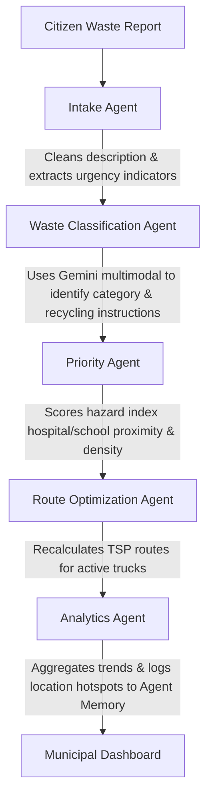

# SmartWaste AI: Multi-Agent Waste Collection & Route Optimization

SmartWaste AI is an intelligent, multi-agent waste management and route optimization platform developed for modern smart cities. The project is designed as a **Google Kaggle AI Agents Capstone Project**, demonstrating multi-agent systems, Model Context Protocol (MCP), tool calling, agent memory, and secure role-based access controls.

---

## Technical Stack

### Frontend
- **Framework**: React 19, TypeScript, Vite
- **Styling**: Modern, responsive Custom CSS variables (glassmorphism cards, dynamic grid layouts)
- **Routing**: React Router (guarded dashboard and tool routes)
- **State & Client**: React Context API, Axios (configured interceptors automatically inject JWT tokens)
- **Icons & Graphics**: Lucide React, Premium SVG vector charts
- **Mapping**: OpenStreetMap + Leaflet.js (render interactive bins, dispatches, and routes)

### Backend
- **Framework**: Python 3.12, FastAPI
- **Database**: SQLite, SQLAlchemy ORM
- **Security**: JWT tokens, bcrypt cryptography hashing, Role-Based Access Control (RBAC)
- **AI Engine**: Google GenAI SDK (Gemini 2.5), shared SQL Agent Memory, modular Agent pipelines
- **MCP Protocol**: Low-level official Model Context Protocol standard python SDK stdio transport server

---

## Directory Structure

```text
capstone/
├── backend/
│   ├── agents/
│   │   ├── agent_orchestrator.py      # Main pipeline dispatcher
│   │   ├── complaint_agent.py         # Intake Agent (text parsing)
│   │   ├── classification_agent.py    # Waste Classification Agent (Gemini multimodal)
│   │   ├── priority_agent.py          # Priority Agent (geodesic distance & density)
│   │   ├── route_agent.py             # Route Optimization Agent (TSP Solver)
│   │   └── analytics_agent.py         # Analytics Agent (aggregations)
│   ├── api/
│   │   └── routes.py                  # API endpoints (Auth, Bins, Complaints, Fleet, Chat)
│   ├── auth/
│   │   └── auth.py                    # JWT validation and native bcrypt hashing
│   ├── database/
│   │   ├── db.py                      # SQLAlchemy connection manager
│   │   └── models.py                  # SQLite database models
│   ├── mcp/
│   │   └── mcp_server.py              # MCP Server and Tool Registry (DB, FS, Maps, Stats)
│   ├── schemas/
│   │   └── schemas.py                 # Pydantic validation schemas
│   ├── main.py                        # FastAPI entry point & startup database seeding
│   ├── requirements.txt               # Backend dependencies
│   └── .env                           # Environment configuration
└── frontend/
    ├── src/
    │   ├── components/                # Map components
    │   ├── contexts/
    │   │   └── AuthContext.tsx        # Persistent session provider
    │   ├── layouts/
    │   │   └── Navbar.tsx             # Responsive header with notification tray
    │   ├── pages/
    │   │   ├── LandingPage.tsx        # Smart City introduction screen
    │   │   ├── Login.tsx              # Sign in form with role redirections
    │   │   ├── Register.tsx           # SignUp form with role options
    │   │   ├── Profile.tsx            # User profile dashboard & logout
    │   │   ├── CitizenDashboard.tsx   # Citizen complaint log & bin finder
    │   │   ├── ReportComplaint.tsx    # Complaint submit form with Leaflet coordinate pin
    │   │   ├── ComplaintDetails.tsx   # Details panel with dispatch assignments
    │   │   ├── MunicipalDashboard.tsx # Officer controls with active priority queue and graphs
    │   │   ├── RoutePlanner.tsx       # Dispatch mapping coordinates and polyline paths
    │   │   ├── Analytics.tsx          # Incident metrics, hotspots, and predictive overflows
    │   │   ├── RecyclingAssistant.tsx # Advisor chatbot
    │   │   └── NotFound.tsx           # 404 page
    │   ├── services/
    │   │   └── api.ts                 # Intercepted Axios instances
    │   ├── styles/
    │   │   └── index.css              # Styling system variables
    │   ├── App.tsx                    # Route manager and guards
    │   └── main.tsx                   # Render node
    ├── package.json                   # Frontend dependencies
    └── tsconfig.json                  # TypeScript compiler settings
```

---

## Agent Workflow & Orchestration

SmartWaste AI implements a chained multi-agent pipeline using Google ADK design patterns. When a citizen submits a waste complaint, it executes the following sequence:



1. **Complaint Intake Agent**: Cleans descriptions and identifies landmark/urgency markers.
2. **Waste Classification Agent**: Evaluates descriptions or photos using Gemini to categorize waste (plastic, paper, organic, e-waste, glass, metal, mixed).
3. **Priority Agent**: Computes priority score based on proximity to public institutions (hospitals/schools), complaint age, regional report density, and past location history from memory.
4. **Route Optimization Agent**: Auto-allocates complaints to the closest truck and resolves the Traveling Salesperson Problem (TSP) using a Nearest-Neighbor tour, storing coordinates routing in the database.
5. **Analytics Agent**: Records global metrics and tags repeat hotspots in the persistent `agent_memory` table.

---

## MCP Server Tools

The custom standard stdio transport Model Context Protocol (MCP) server exposes structural tools to the agent cluster:
- `query_database_bins`: Fetches capacity/fill status.
- `query_database_complaints`: Retrieves logged reports with optional status filtering.
- `file_system_write_report`: Saves text summaries to the local filesystem disk.
- `mapping_calculate_route_matrix`: Outputs distance metrics and stop sequences for trucks.
- `analytics_detect_hotspots`: Groups geographic reports to compute regional risk levels.

---

## Installation & Setup

### Requirements
- Node.js (v18+)
- Python (v3.10+)

### 1. Backend Server Setup
1. Open a terminal and navigate to the backend folder:
   ```bash
   cd backend
   ```
2. Create and activate a virtual environment:
   ```bash
   python -m venv venv
   # On Windows (PowerShell):
   .\venv\Scripts\Activate.ps1
   # On macOS/Linux:
   source venv/bin/activate
   ```
3. Install package dependencies:
   ```bash
   pip install -r requirements.txt
   ```
4. Copy the environment variables template and add your `GEMINI_API_KEY`:
   ```bash
   # Add your key to GEMINI_API_KEY in the generated .env file
   ```
5. Start the server:
   ```bash
   uvicorn main:app --reload
   ```
   *FastAPI will launch on `http://127.0.0.1:8000`. The server automatically seeds initial data (demo users, trucks, and bins).*

### 2. Frontend Client Setup
1. Open a new terminal and navigate to the frontend folder:
   ```bash
   cd frontend
   ```
2. Install npm dependencies:
   ```bash
   npm install --legacy-peer-deps
   ```
3. Boot the development client:
   ```bash
   npm run dev
   ```
   *Open `http://localhost:5173` in your browser.*

---

## Pre-Seeded Simulation Accounts

Explore the dashboard immediately using these credentials:
- **Citizen Account**:
  - Email: `citizen@smartwaste.ai`
  - Password: `password123`
- **Municipal Officer**:
  - Email: `officer@smartwaste.ai`
  - Password: `password123`

---

## API Routes Documentation

### Authentication
- `POST /api/auth/register` - Create user profile.
- `POST /api/auth/login` - Validate credentials (expects form data) and returns access token.

### Bins & Trucks
- `GET /api/bins` - Retrieve all city-wide bins.
- `POST /api/bins` - Log a bin coordinate (officer permissions).
- `GET /api/trucks` - View all active trucks and route polylines.
- `POST /api/trucks` - Log a collection truck (officer permissions).

### Complaints
- `POST /api/complaints` - Submit a waste report (auto-triggers AI Agent pipeline).
- `GET /api/complaints/my` - Fetch complaints registered by the current citizen.
- `GET /api/complaints/all` - Priority-sorted complaint list (officer permissions).
- `GET /api/complaints/{id}` - View details and location coordinates.
- `PUT /api/complaints/{id}` - Update dispatch details, priority overrides, and truck assignments (officer permissions).
- `POST /api/complaints/upload` - Securely upload images (.jpg, .jpeg, .png, .webp).

### General
- `GET /api/notifications` - Fetch user notification trays.
- `PUT /api/notifications/{id}/read` - Mark a notification as read.
- `POST /api/assistant/chat` - Query recycling recommendations from the assistant.
